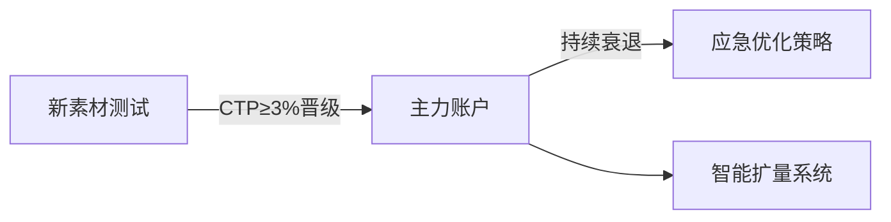

# Facebook广告智能优化全流程解决方案

---

## 一、动态账户架构体系

### 1.1 三阶段账户矩阵


### 1.2 全自动调控规则
| 事件触发器        | 判定标准              | 应对方案                  |
|-------------------|-----------------------|---------------------------|
| CPM异常波动       | 涨幅超过40%持续3小时  | 立即暂停 → 次日0点重启     |
| CTR连续下滑       | 日衰减率>15%          | 激活备选素材库前三名       |
| ROAS持续达标      | 稳定72小时≥2.5        | 自动追加30%黄金时段预算    |

---

## 二、创意革命工场

### 2.1 五维测试矩阵
**要素组合策略**
- 视频素材：前3秒悬念开场 + 进度提示 + 实时弹幕
- 轮播广告：产品演变史 + 真实用户证言 + 质检报告
- 图文素材：痛点场景图 + 价格对比表 + 限时闪购标
- 互动广告：动态投票 + 实时库存显示 + 浮动倒计时

### 2.2 素材熔断机制
```processing
当触发以下任一条件时启动：
1. 单日CPM上涨＞30%
2. 3小时CTR跌幅＞20%
3. 转化成本＞平均值的35%

执行动作：
→ 启用备用素材TOP3
→ 下调出价15%-20%
→ 调整版位至Messenger
```

---

## 三、智能受众网络

### 3.1 六阶用户模型
| 用户画像          | 行为特征               | 培育策略                |
|-------------------|------------------------|-------------------------|
| 新访客            | 首屏跳出率>80%        | 悬念式痛点广告          |
| 浅层活跃          | 访问2-3个产品页        | 场景解决方案广告        |
| 深度意向          | 参数页停留≥90秒        | 专家测评+对比广告       |
| 决策犹豫          | 加购放弃次数>2次       | 动态库存预警+专属折扣   |
| 短期休眠          | 15天未复访             | 唤醒优惠+新品预告       |
| 忠实用户          | 复购周期≤30天          | VIP特权+捆绑销售        |

### 3.2 再营销技术栈
**高级像素配置方案**
```bash
# 定制事件体系
ViewContent → 页面停留≥30s
AddPaymentInfo → 支付信息录入未完成 
Purchase → 支付成功二次验证

# 智能营销策略
购物车放弃用户 → 2h后Push专享优惠
深度浏览用户 → 触发客服实时对话
复购临界用户 → 提前3天推送会员权益
```

---

## 四、数据决策中心

### 4.1 健康监测模型
| 核心指标          | 警戒阈值          | 优化方案                   |
|-------------------|-------------------|----------------------------|
| 频次指数          | >3次/周           | 清洗60天旧受众             |
| 素材衰减率        | >18%             | 启动元素模块重组           |
| 时段效率偏差      | >25%             | 分时预算动态调节           |
| 兴趣词匹配度      | <70%             | 补充10个新兴趣词           |

### 4.2 智能调控系统
```python
def auto_optimize():
    if CTR < baseline * 0.8:
        rotate_creatives(top3_reserves)
    if conversion_rate > target * 1.2:
        increase_bid(peak_hours, 8-10PM)
    if CPM > hist_avg * 1.4:
        switch_to_messenger_placement()
```

---

## 五、长效运营体系

### 5.1 素材生命周期
**四阶管理模型**
| 阶段   | 关键动作                  | 淘汰标准              |
|--------|---------------------------|-----------------------|
| 孵化期 | 5组AB测试                | ROI<1.5自动淘汰       |
| 成长期 | 智能投放扩展              | CTR连续3天<2%        |
| 高峰期 | 全时段精准投放            | 单日衰减率>5%        |
| 衰退期 | 元素解构重组              | 综合效能指数<55       |

### 5.2 团队协作标准
**全链路规范**
- 素材命名：日期_品类_介质类型_版本（例：0425_美妆_视频_V6）
- 数据追踪：每小时自动刷新核心指标看板
- 应急响应：设置黄金30分钟响应机制（红色警报即时处理）
[教学视频](https://youtube.com/shorts/2gzFe4Hwnno?feature=share)
```
